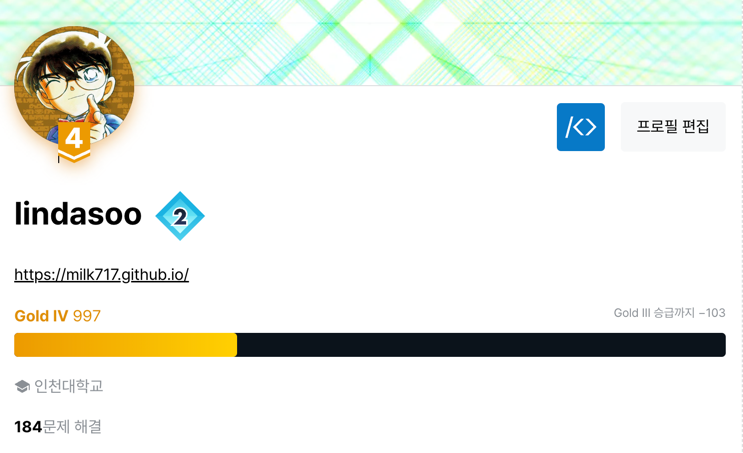
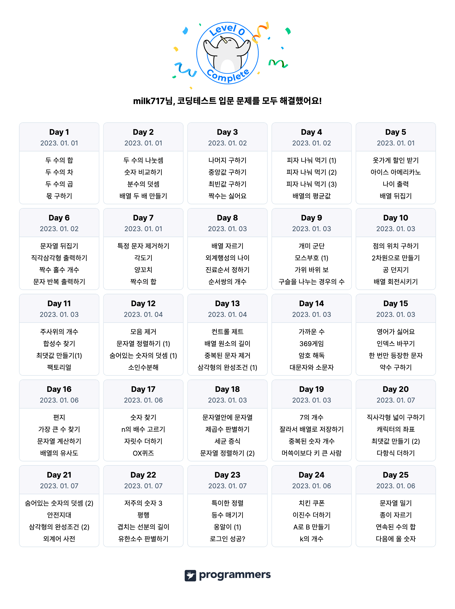
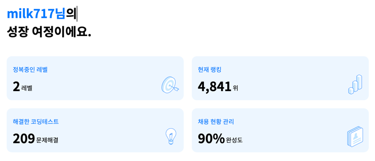

# 알고리즘 문제풀기 코드 저장소

## 참고자료
### 알고리즘 커리큘럼 참고
[PS 시작하기](https://plzrun.tistory.com/entry/%EC%95%8C%EA%B3%A0%EB%A6%AC%EC%A6%98-%EB%AC%B8%EC%A0%9C%ED%92%80%EC%9D%B4PS-%EC%8B%9C%EC%9E%91%ED%95%98%EA%B8%B0)
### JS로 알고리즘 풀기
[자바스크립트로 풀만한 백준 문제](https://github.com/haesoo-y/baekjoon-for-js)  
[백준 자바스크립트 입출력 파일시스템 이용](https://wonyoung2257.tistory.com/36)  
[백준 자바스크립트 입출력 한줄씩](https://nyang-in.tistory.com/156)  

> 지금까지 푼 모든 알고리즘 문제를 올리진 않았습니다.
> 코딩테스트 대비를 위해 프로그래머스에서 직접 코드를 작성한 경우가 많아서 모두 올리기엔 너무나 귀찮았음...

## 연혁
### 2020-11 Start
프로그래밍 입문 파이썬 수업을 듣고 문제를 해결하는 것이 너무 재미있어서 알고리즘 문제 풀이를 시작하게 되었다.  
이 때는 알고리즘이나 자료구조에 대한 지식이 전혀 없었고, 체계적인 학습보다 악으로 깡으로 문제를 해결할 때 까지 붙잡고 있는 것이 최고의 태도라고 생각했다.  
덕분에 아주 비효율의 끝판왕인 공부를 했고, 남은 것은 삽질에 대처하는 멘탈 뿐이었다.(깡통뿐인 백준 Gold4)

### 2021-03 Pause
이 때를 기점으로 알고리즘 공부를 소홀히 했다.  
가끔 한달에 한두문제 정도 깨작깨작 풀어보긴 했지만, 알고리즘을 익히기 위해서가 아닌 코틀린 언어를 익히기 위해 쉬운 문제 위주로 풀었다.

### 2023-01 Restart
이제 졸업이 다가와서 그런지 정신이 확 들었다.  
프론트엔드 개발자가 되기로 80%정도 마음을 굳혔고, 4학년1학기가 끝나고 휴학을 한 다음에 대외활동에 지원하고 싶어서 본격적이고 체계적으로 공부하기 시작했다.  
우선 자바스크립트 언어로 코딩테스트를 풀기 위해 프로그래머스에 있는 코딩테스트 입문 문제를 풀었다.  
알고리즘 문제를 푸는데 있어서 문제 해결 로직때문에 막히는 일은 있어도 문법이 헷갈려서 막히는 일은 없도록 하자는 마음으로 문제를 풀었다.  

### 2023-03
2023년 3월 12일 기준 현황입니다.

프로그래머스 0, 1레벨 문제는 모두 풀었고 2레벨 문제를 푸는 중이다.  
1학년 때의 실수를 반복하지 않도록 이번에는 체계적으로 공부할 것이다.

